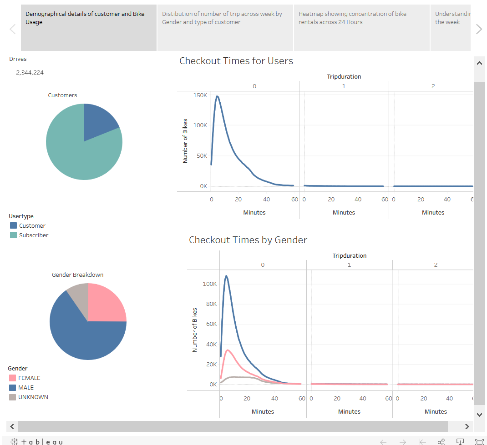
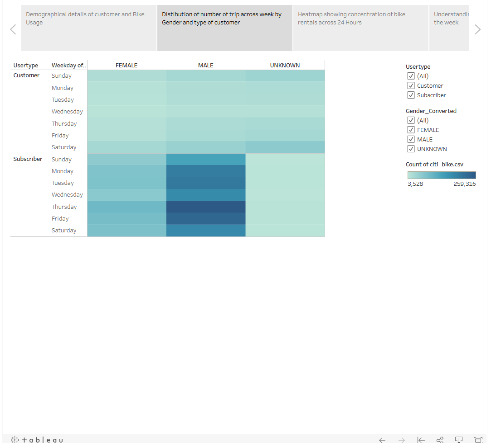
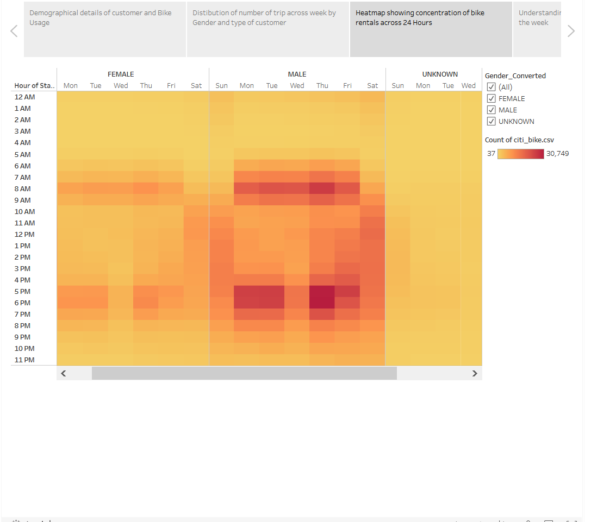
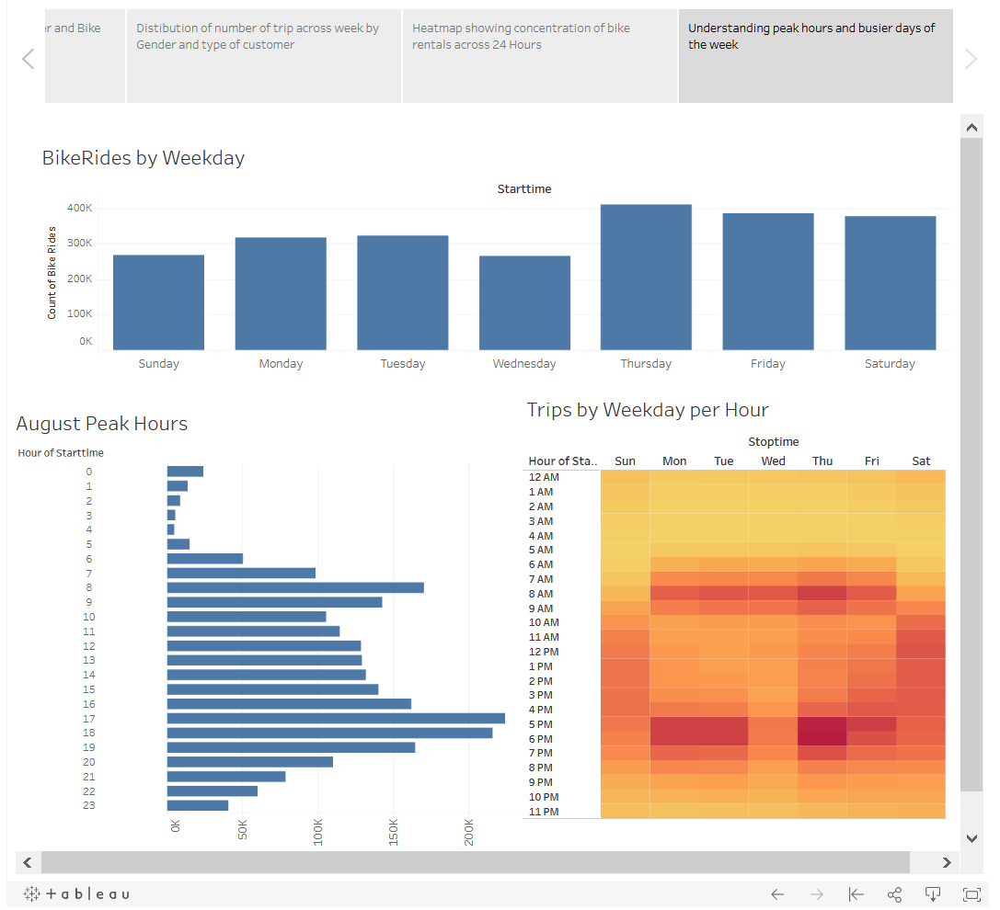

# NYC Bike Sharing Analysis

## Overview 
The project is to understand NYC bike sharing program, so as to pitch a new business for bike sharing in Des Moines to investors. The analysis is done on the August month data available on Citi Bike system page online using Tableau.

## Purpose
The purpose of this project is to analyse Citi Bike data using Tableau to make sales pitch for a new business of similar kind in Des Moines. 

## Results

A detailed analysis was performed on the Citi Bike data and story line of the analysis is available at below link. The dashboards are interactive and can be used to further drill down the analysis and understand more granularity of the data. 

[Link to Tableau Story](https://public.tableau.com/profile/kushal.sharma3268#!/vizhome/BikeTrip-Analysis-Challenge/BikeRideAnalysis)

Fig # 14.1 Customer Demographics

There were 2,344,224 number of bike rides took place during August month of 2019. The pie chart for the type of customers clearly depicts that most of the rides were taken by Subscriber and hence it makes the bike ride business more hit for the regular users. However, almost 19% of the rides were by the new customers or occasional customers, which also gives good prospects of new subscribers.

On analysing the average checkout time by users, it shows that the trip duration for bike rentals was less than an hour, and this will help to utilize bikes more effectively with less bikes and more rides. 

If we check the visualization of bike usage by gender, it is prominent that male users are using the bike rides (65%) more often than female users (25%). However, if we try to see the ratio under subscribed customers, it is more skewed as male subscriber base is 72% and female subscriber base is 21%.  There is potential market for subscribed female customers and which need to be explored and it can help to drive more sales.

Fig # 14.2 Customer type vs Bike rides by weekdays

As the type of customer is important to understand the sales dynamics of the bike rentals, on analysing the type of customers, gender of customers across the usage of bike rides during different weekdays gives an interesting observation. The subscribed customers have more concentration of bike usage during work days (Monday to Friday). It seems office goers are subscribing to rental service as they use bike ride for daily commute. While the unsubscribed customers have higher usage during weekends, mostly for the leisure activities like going to park, a party or just enjoying NYC neighbourhood. Hence, programs can be developed directed towards attracting new unsubscribed customers for weekends and subscribed customers during weekdays.

Fig # 14.3 Bike rides by weekdays vs day hours by gender

To understand and validate the hypothesis done in previous slide, bike rides are plotted for weekdays versus day hours. The heatmap elaborates hypothesis more clearly, as usage of bike rides is more during peak hours in weekdays, in morning from 06:00 A.M to 10:00 A.M, and in evening 04:00 P.M to 08:00 P.M., generally office start and end hours. While, the pattern is opposite for weekends, as the usage is more scattered and concentration of high usage is during 09:00 A.M to 06:00 P.M., mostly seems for whole day leisure activities. 

Fig # 14.4 Bike rides by day hours and weekdays
On exploring more on the pattern of bike rentals during weekdays and during peak hours, it becomes more evident that bikes are used more during peak hours / office hours during weekdays and more during daytime in weekends. However, if the bar graph on the top for weekdays bike rides is checked, it shows a dip in bike rides during Wednesdays. On further drilling down, it shows evening bike rides for Wednesday are going down significantly. The reason could be substitute transport usage, mid-week fatigue or can be the new 4 days a week program. This worth to investigate and find out the reason, as it can help to boost some sales during weekdays. 

## Summary

The analysis of bike ride data shows that it is more relied on the subscribed users as they contribute highly towards the usage. Also, bike rides are shorter and hence provide a better scenario of resource / bike utilization if managed efficiently. This will also help in maintaining bike and can be subjected to more frequent small overhaul during weekdays (non-peak hours) and full over haul in few months. This makes the proposition of the business stronger and withholding. However, there are avenues which can be explored such as weekend unsubscribed user base, female subscribed customers and streamlining the users during all work weekdays can bring in more revenue for the business.

Visualization for future analysis:
1.	A chart to show comparison of number of bike rides during weekday and weekend by customer types to understand the usage by customer type. 
2.	A chart depicting average usage of a bike (length of trip + number of trips) during a week to estimate average utilization of bike and repair time
